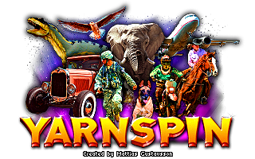

# Programmer Handbook

---
## Contents

 - [1. Introduction](#1-introduction) 
 - [2. Building the code](#2-building-the-code) 
 - [3. What's in the engine](#3-whats-in-the-engine)
 - [4. The main function](#4-the-main-function)
 - [5. License](#5-license)
---


## 1. Introduction

Welcome to the world of *Yarnspin*, a friendly and approachable game engine designed to help you create your very own choose-your-own-adventure story games! Drawing inspiration from home computer game development tools from the 1980s and 1990s, Yarnspin aims to provide an accessible and enjoyable experience, whether you're a seasoned developer or just starting out. In this introductory chapter, we'll cover the essential information you need to get started with Yarnspin engine, including system requirements, how to make the most of this manual, and what you'll find in the Yarnspin engine. So, let's dive in!


### System Requirements

Yarnspin engine will compile on Windows, MacOS, Linux and web browsers.

You will need a C compiler. tcc, gcc, clang and msvc are supported out of the box.

In addition to a compiler, you will also need a code editor - any code editor will work, as long as it can save plain text files. Sublime (www.sublimetext.com) is a popular choice that runs on all three operating systems.

It might also be useful to have a debugging tools to use alongside the compiler.


### Using This Manual

This manual is designed to be your comprehensive guide to Yarnspin engine, providing you with all the information you need to work with the engine's source code.

In addition to explaining key concepts, the manual will walk you through the process of adding a new feature to the engine. By breaking down the code, you'll gain an understanding of how the various components of Yarnspin engine work together to tailor the engine to your needs.

As you progress through the manual, you'll find numerous examples, tips, and best practices that will help you become proficient in programming the Yarnspin engine. 


## 2. Building the code

No build system is used, simply call the compiler from the commandline.


### Windows

From a Visual Studio Developer Command Prompt, do:
```
  cl source\yarnspin.c
```

For building the final release version, you probably want all optimizations enabled. There's a helper script (a windows bat file) in the `build` folder of the repo, which will build with full optimizations, and also include an application icon. It will also call the compiled exe to generate the `yarnspin.dat` data file, and then append the file to the end of the executable, giving you a single exe you can distribute which contains both code and data. No need to include the yarnspin.dat file. See the `build\build_win.bat` file for details.


### Mac

```
  clang source/yarnspin.c `sdl2-config --libs --cflags` -lGLEW -framework OpenGL -lpthread
```

SDL2 and GLEW are required - if you don't have them installed you can do so with Homebrew by running
```
  brew install sdl2 glew
```


### Linux

```
  gcc source/yarnspin.c `sdl2-config --libs --cflags` -lGLEW -lGL -lm -lpthread
```

SDL2 and GLEW are required - if you don't have them installed you can do so on Ubuntu (or wherever `apt-get` is available) by running
```
  sudo apt-get install libsdl2-dev
  sudo apt-get install libglew-dev
```


## 3. What's in the engine

When you open up the engine source folder, you'll find a set of folders and files.

Here's a quick overview of what each file contains:

| File name | Description | Lines (rounded) |
| --------- | ----------- | ----- |
| `libs/app.h` | Small cross-platform base framework for graphical apps. | 4.8k |
| `libs/array.h` | Dynamic array library for C/C++. | 0.3k |
| `libs/audiosys.h` | Sound and music playback (mixing only) for C/C++. | 1.3k |
| `libs/buffer.h` | Memory buffer with read/write operations, for C/C++. | 0.4k |
| `libs/crtemu.h` | Cathode ray tube emulation shader for C/C++. | 2k |
| `libs/cstr.h` | String interning library for C/C++. | 2.5k |
| `libs/dir.h` | Directory listing functions for C/C++. | 0.3k |
| `libs/dr_flac.h` | FLAC audio decoder. | 12.5k |
| `libs/dr_mp3.h` | MP3 audio decoder. | 4.8k |
| `libs/dr_wav.h` | WAV audio loader and writer. | 8.4k |
| `libs/file.h` | C/C++ functions to load/save an entire file to/from memory. | 0.2k |
| `libs/frametimer.h` | Framerate timer functionality. | 0.3k |
| `libs/glad.h` | Automatically generated OpenGL loader. | 5.4k |
| `libs/img.h` | Image processing functions for C/C++. | 0.4k |
| `libs/ini.h` | Simple ini-file reader for C/C++. | 1.1k |
| `libs/lzma.h` | Single header version of Igor Pavlov's LzmaLib. | 5.6k |
| `libs/paldither.h` | Convert true-color image to custom palette, with dither. | 0.7k |
| `libs/palettize.h` | Median-cut palette generation and remapping for C/C++. | 0.7k |
| `libs/palrle.h` | Run-length encoding of palettized bitmaps, for C/C++. | 0.4k |
| `libs/pixelfont.h` | Custom pixel font format builder and renderer. | 0.5k |
| `libs/qoa.h` | QOA - The "Quite OK Audio" format for fast, lossy audio compression. | 0.7k |
| `libs/qoi.h` | QOI - The "Quite OK Image" format for fast, lossless image compression. | 0.6k |
| `libs/rnd.h` | Pseudo-random number generators for C/C++. | 0.6k |
| `libs/samplerate.h` | An audio Sample Rate Conversion library. | 368k |
| `libs/stb_image.h` | Image loading/decoding from file/memory: JPG, PNG, TGA, BMP, PSD, GIF, HDR, PIC. | 7.9k |
| `libs/stb_image_resize.h` | Resize images larger/smaller with good quality. | 2.6k |
| `libs/stb_image_write.h` | Writes out PNG/BMP/TGA/JPEG/HDR images to C stdio. | 1.7k |
| `libs/stb_rect_pack.h` | Simple 2D rectangle packer with decent quality. | 0.6k |
| `libs/stb_truetype.h` | Parse, decode, and rasterize characters from truetype fonts. | 5k |
| `libs/stb_vorbis.h` | Decode ogg vorbis files from file/memory to float/16-bit signed output. | 5.6k |
| `libs/sysfont.h` | Simple debug text renderer for C/C++. | 0.3k |
| `libs/thread.h` | Cross platform threading functions for C/C++. | 1.5k |
| `libs/ya_getopt.h` | Single header version of ya_getopt: parse command-line options. | 0.4k |

Now the actual engine files:

| File name | Description | Lines (rounded) |
| --------- | ----------- | ----- |
| `audioconv.h` | Utility for loading OGG/WAV/FLAC/MP3 audio files into QOI format. | 0.1k |
| `game.h` | The entire game state logic. | 2.5k |
| `gfxconv.h` | Utilities for tansformation of various graphics data. | 1.6k |
| `imgedit.h` | The Yarnspin image editor. | 1.6k |
| `input.h` | Keyboard and mouse input state tracking based on `libs/app.h`. | 0.1k |
| `memmgr.h` | Automatic memory management helper. | 0.1k |
| `render.h` | The Yarnspin OpenGL renderer. | 1.5k |
| `yarn.h` | A yarn is a package of data for yarnspin to run, that's where all game files live in. | 1.8k |
| `yarn_compiler.h` | The compiler for the Yarn scripting language. | 2.2k |
| `yarn_lexer.h` | The lexer for the Yarn scripting language. | 0.3k |
| `yarn_parser.h` | The parser for the Yarn scripting language. | 0.3k |
| `yarnspin.c` | Serves as both a unity build file for the entire engine and also as a coordinator to assemble and run every part of the engine together. | 2.3k |


## 4. The main function

The main function is the entry point of the engine.
You may find the main function in the file `yarnspin.c` between approximately line 700 to line 1200.

Begin of main function:
https://github.com/aganm/yarnspin/blob/049f6a0123376a460437bdde6560f277a6e90b84/source/yarnspin.c#L734
End of main function:
https://github.com/aganm/yarnspin/blob/049f6a0123376a460437bdde6560f277a6e90b84/source/yarnspin.c#L1160

The main function can be broken down in these distinct steps:

1. Enable windows memory leak detection, if applicable.
2. Pre-initialize OpenGL, if applicable.
3. Parse the command line options of yarnspin (`i,r,d,c,n,w,f,p`) with getopt library.
4. Validate the use of the option `-p` or `--package`.
5. Run yarnspin in image editor mode if `-i` or `--images` were specified.
If using images mode, the main function loops over `app_run` from the app library
with the `imgedit_proc` callback. Then main **returns** after `app_run` finishes.
6. Now yarnspin compiles and compresses your game files into a yarn package with the buffer library,
and writes it on disk. At the same time, the version string is written into the save file data.
7. Load and decompress an external yarn data file if present with the buffer library,
or check to load from the end of executable if no external data file is present, also with the help of the buffer library.
8. If `-c` or `--compile` were specific, don't run the game, just **return** here, after compiling the yarn.
9. Load the yarn state from the decompressed yarn data buffer: this is a function of the `yarn.h` engine file.
Then destroy the data buffer, it won't be needed no more.
10. If `-p` or `--package` were specified, don't run the game,
instead package the exe after compiling the yarn and **return**.
11. If `-n` or `--nosound` were specified, set global variable `g_disable_sound` to true.
12. If `-w` or `--window` were specified, set yarn variable `screenmode` to window mode.
13. If `-f` or `--fullscreen` were specified, set yarn variable `screenmode` to fullscreen mode.
14. Finally, main **returns** by handing over the control of the program to `app_run`
from the app library with the `app_proc` callback.

The main function takes care of executing the general engine features outside of the game itself.


## 5. License

The majority of the code are under the following license. Exceptions below.

```
This software is available under 2 licenses - you may choose the one you 


ALTERNATIVE A - MIT License

Copyright (c) 2022 Mattias Gustavsson

Permission is hereby granted, free of charge, to any person obtaining a copy of
this software and associated documentation files (the "Software"), to deal in
the Software without restriction, including without limitation the rights to
use, copy, modify, merge, publish, distribute, sublicense, and/or sell copies
of the Software, and to permit persons to whom the Software is furnished to do
so, subject to the following conditions:

The above copyright notice and this permission notice shall be included in all
copies or substantial portions of the Software.

THE SOFTWARE IS PROVIDED "AS IS", WITHOUT WARRANTY OF ANY KIND, EXPRESS OR
IMPLIED, INCLUDING BUT NOT LIMITED TO THE WARRANTIES OF MERCHANTABILITY,
FITNESS FOR A PARTICULAR PURPOSE AND NONINFRINGEMENT. IN NO EVENT SHALL THE
AUTHORS OR COPYRIGHT HOLDERS BE LIABLE FOR ANY CLAIM, DAMAGES OR OTHER
LIABILITY, WHETHER IN AN ACTION OF CONTRACT, TORT OR OTHERWISE, ARISING FROM,
OUT OF OR IN CONNECTION WITH THE SOFTWARE OR THE USE OR OTHER DEALINGS IN THE
SOFTWARE.


ALTERNATIVE B - Public Domain (www.unlicense.org)

This is free and unencumbered software released into the public domain.

Anyone is free to copy, modify, publish, use, compile, sell, or distribute this
software, either in source code form or as a compiled binary, for any purpose,
commercial or non-commercial, and by any means.

In jurisdictions that recognize copyright laws, the author or authors of this
software dedicate any and all copyright interest in the software to the public
domain. We make this dedication for the benefit of the public at large and to
the detriment of our heirs and successors. We intend this dedication to be an
overt act of relinquishment in perpetuity of all present and future rights to
this software under copyright law.

THE SOFTWARE IS PROVIDED "AS IS", WITHOUT WARRANTY OF ANY KIND, EXPRESS OR
IMPLIED, INCLUDING BUT NOT LIMITED TO THE WARRANTIES OF MERCHANTABILITY,
FITNESS FOR A PARTICULAR PURPOSE AND NONINFRINGEMENT. IN NO EVENT SHALL THE
AUTHORS BE LIABLE FOR ANY CLAIM, DAMAGES OR OTHER LIABILITY, WHETHER IN AN
ACTION OF CONTRACT, TORT OR OTHERWISE, ARISING FROM, OUT OF OR IN CONNECTION
WITH THE SOFTWARE OR THE USE OR OTHER DEALINGS IN THE SOFTWARE.
```

Yarnspin makes use of the QOI and QOA image and audio formats, which are
released under the following license:

```
MIT License

Copyright (c) 2022-2023 Dominic Szablewski

Permission is hereby granted, free of charge, to any person obtaining a copy
of this software and associated documentation files (the "Software"), to deal
in the Software without restriction, including without limitation the rights
to use, copy, modify, merge, publish, distribute, sublicense, and/or sell
copies of the Software, and to permit persons to whom the Software is
furnished to do so, subject to the following conditions:

The above copyright notice and this permission notice shall be included in all
copies or substantial portions of the Software.

THE SOFTWARE IS PROVIDED "AS IS", WITHOUT WARRANTY OF ANY KIND, EXPRESS OR
IMPLIED, INCLUDING BUT NOT LIMITED TO THE WARRANTIES OF MERCHANTABILITY,
FITNESS FOR A PARTICULAR PURPOSE AND NONINFRINGEMENT. IN NO EVENT SHALL THE
AUTHORS OR COPYRIGHT HOLDERS BE LIABLE FOR ANY CLAIM, DAMAGES OR OTHER
LIABILITY, WHETHER IN AN ACTION OF CONTRACT, TORT OR OTHERWISE, ARISING FROM,
OUT OF OR IN CONNECTION WITH THE SOFTWARE OR THE USE OR OTHER DEALINGS IN THE
SOFTWARE.
```

Yarnspin makes use of the ya_get_opt library released under this license:

```
Copyright 2015 Kubo Takehiro <kubo@jiubao.org>

Redistribution and use in source and binary forms, with or without
modification, are permitted provided that the following conditions are met:

   1. Redistributions of source code must retain the above copyright notice, 
      this list of conditions and the following disclaimer.

   2. Redistributions in binary form must reproduce the above copyright 
      notice, this list of conditions and the following disclaimer in the 
      documentation and/or other materials provided with the distribution.

THIS SOFTWARE IS PROVIDED BY THE AUTHORS ''AS IS'' AND ANY EXPRESS OR IMPLIED
WARRANTIES, INCLUDING, BUT NOT LIMITED TO, THE IMPLIED WARRANTIES OF 
MERCHANTABILITY AND FITNESS FOR A PARTICULAR PURPOSE ARE DISCLAIMED. IN NO 
EVENT SHALL <COPYRIGHT HOLDER> OR CONTRIBUTORS BE LIABLE FOR ANY DIRECT, 
INDIRECT, INCIDENTAL, SPECIAL, EXEMPLARY, OR CONSEQUENTIAL DAMAGES (INCLUDING,
BUT NOT LIMITED TO, PROCUREMENT OF SUBSTITUTE GOODS OR SERVICES; LOSS OF USE, 
DATA, OR PROFITS; OR BUSINESS INTERRUPTION) HOWEVER CAUSED AND ON ANY THEORY 
OF LIABILITY, WHETHER IN CONTRACT, STRICT LIABILITY, OR TORT (INCLUDING
NEGLIGENCE OR OTHERWISE) ARISING IN ANY WAY OUT OF THE USE OF THIS SOFTWARE, 
EVEN IF ADVISED OF THE POSSIBILITY OF SUCH DAMAGE.

The views and conclusions contained in the software and documentation are 
those of the authors and should not be interpreted as representing official 
policies, either expressed or implied, of the authors.
```

As part of its asset conditioning, Yarnspin makes use of libsamplerate to 
process sound files. This code is however not present at runtime. This lib is
released under the following license:

```
Copyright (c) 2012-2016, Erik de Castro Lopo <erikd@mega-nerd.com>
All rights reserved.

Redistribution and use in source and binary forms, with or without
modification, are permitted provided that the following conditions are
met:

1. Redistributions of source code must retain the above copyright
   notice, this list of conditions and the following disclaimer.

2. Redistributions in binary form must reproduce the above copyright
   notice, this list of conditions and the following disclaimer in the
   documentation and/or other materials provided with the distribution.

THIS SOFTWARE IS PROVIDED BY THE COPYRIGHT HOLDERS AND CONTRIBUTORS "AS
IS" AND ANY EXPRESS OR IMPLIED WARRANTIES, INCLUDING, BUT NOT LIMITED
TO, THE IMPLIED WARRANTIES OF MERCHANTABILITY AND FITNESS FOR A
PARTICULAR PURPOSE ARE DISCLAIMED. IN NO EVENT SHALL THE COPYRIGHT
HOLDER OR CONTRIBUTORS BE LIABLE FOR ANY DIRECT, INDIRECT, INCIDENTAL,
SPECIAL, EXEMPLARY, OR CONSEQUENTIAL DAMAGES (INCLUDING, BUT NOT LIMITED
TO, PROCUREMENT OF SUBSTITUTE GOODS OR SERVICES; LOSS OF USE, DATA, OR
PROFITS; OR BUSINESS INTERRUPTION) HOWEVER CAUSED AND ON ANY THEORY OF
LIABILITY, WHETHER IN CONTRACT, STRICT LIABILITY, OR TORT (INCLUDING
NEGLIGENCE OR OTHERWISE) ARISING IN ANY WAY OUT OF THE USE OF THIS
SOFTWARE, EVEN IF ADVISED OF THE POSSIBILITY OF SUCH DAMAGE.
```

